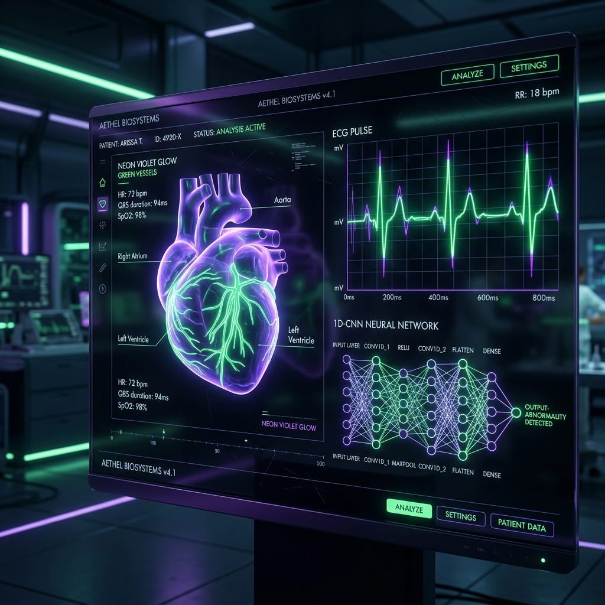
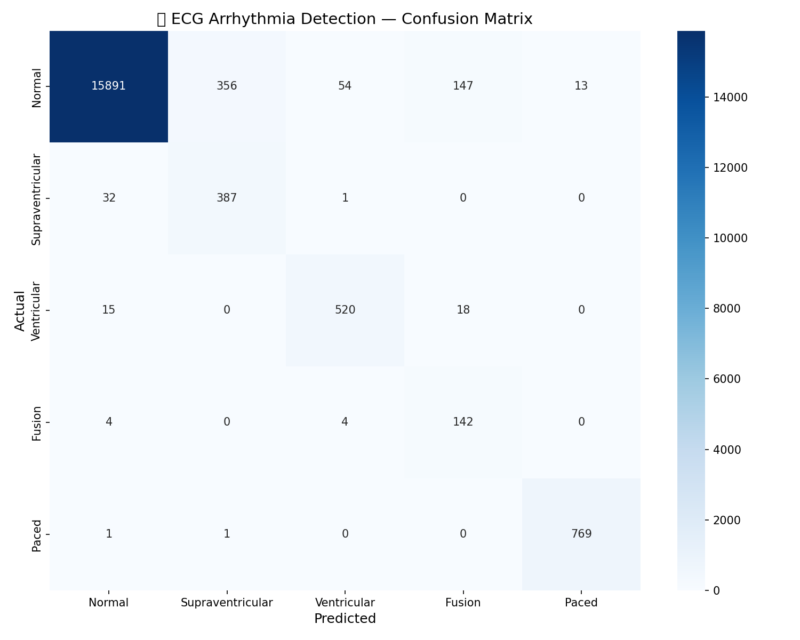
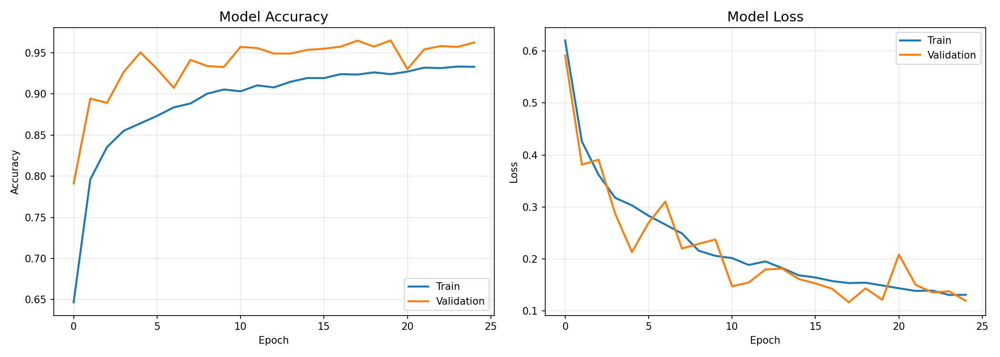
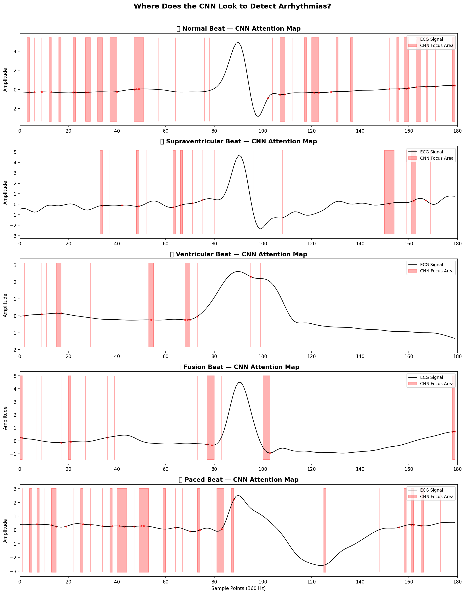

# 🫀 Pulse Nova 1D — ECG Arrhythmia Detection

<p align="center">
  
</p>

<p align="center">
  <a href="https://pulse-nova-1d-project.streamlit.app/">
    
  </a>
</p>

<p align="center">
  
</p>

> **AI-powered detection of life-threatening heart rhythm abnormalities from raw ECG signals using Deep Learning.**
>
> 🚀 **Live Demo:** [pulse-nova-1d-project.streamlit.app](https://pulse-nova-1d-project.streamlit.app/)

<p align="center">
  
  
  
</p>

---

<p align="center">
  
</p>

## 📋 Overview

This project implements a **1D Convolutional Neural Network (1D-CNN)** to classify heartbeats from the **MIT-BIH Arrhythmia Database** into 5 clinically relevant categories based on the **AAMI standard**:

| Class | Description | Risk Level |
|-------|-------------|------------|
| **Normal (N)** | Healthy heart rhythm | ✅ None |
| **Supraventricular (S)** | Abnormal beat from upper chambers | ⚠️ Low-Medium |
| **Ventricular (V)** | Abnormal beat from lower chambers | 🚨 High |
| **Fusion (F)** | Mixed normal + abnormal beat | ⚠️ Medium |
| **Paced (Q)** | Pacemaker-generated beat | 🔋 Expected |

---

## 🏗️ Project Architecture

```
project 58 ECG CNN/
│
├── notebooks/
│   └── 01_eda.ipynb        # 📊 Exploratory Data Analysis & experimentation
│
├── src/                    # ⚙️ Core Python Modules
│   ├── __init__.py         # Package initialization
│   ├── preprocess.py       # Signal filtering, R-peak detection, segmentation
│   ├── model.py            # 1D-CNN architecture definition
│   ├── train.py            # Training loop, early stopping, checkpoints
│   └── evaluate.py         # Confusion matrix, F1-score, saliency maps
│
├── models/                 # 🧠 Saved Artifacts
│   ├── best_ecg_model.h5   # Trained model weights (96.48% accuracy)
│   ├── confusion_matrix.png
│   ├── training_history.png
│   └── saliency_visualization.png
│
├── data/
│   └── raw/                # 📁 MIT-BIH CSV files (48 patient records)
│
├── deployment/             # 🚀 Web Application
│   ├── app.py              # Streamlit interface
│   └── Dockerfile          # Container configuration
│
├── requirements.txt        # 📜 Python dependencies
└── README.md               # 📖 You are here!
```

---

## 🔬 Technical Pipeline

### 1. Signal Preprocessing
```
Raw ECG Signal → Bandpass Filter (0.5-40 Hz) → R-Peak Detection → Beat Segmentation → Z-Score Normalization
```
- **Bandpass filter**: Removes baseline wander (< 0.5 Hz) and high-frequency noise (> 40 Hz)
- **R-peak detection**: Locates heartbeat peaks using scipy's `find_peaks`
- **Segmentation**: Extracts 180-sample windows (±90 samples around each R-peak)
- **Normalization**: Z-score standardization for consistent model input

### 2. Model Architecture
```
Input (180, 1)
    ↓
Conv1D(32, k=5) → BatchNorm → MaxPool(2)
    ↓
Conv1D(64, k=5) → BatchNorm → MaxPool(2) → Dropout(0.3)
    ↓
Conv1D(128, k=3) → BatchNorm → GlobalAvgPool
    ↓
Dense(64, ReLU) → Dropout(0.4)
    ↓
Dense(5, Softmax) → Output
```

### 3. Training Strategy
- **Optimizer**: Adam (lr=0.001, with ReduceLROnPlateau)
- **Loss**: Sparse Categorical Crossentropy
- **Class Weights**: Balanced (to handle medical data imbalance)
- **Early Stopping**: Patience=7, restoring best weights
- **Data**: 48 patient records → ~80,000+ heartbeats

---

## 📊 Results

### Performance Metrics
| Metric | Score |
|--------|-------|
| **Test Accuracy** | **96.48%** |
| Normal (N) | High precision & recall |
| Supraventricular (S) | Good detection despite low sample count |
| Ventricular (V) | Critical class — strong recall |
| Fusion (F) | Rare class — reasonable performance |
| Paced (Q) | Near-perfect detection |

### Visualizations

**Confusion Matrix** — Shows classification performance across all 5 beat types:



**Training History** — Accuracy and loss curves over 50 epochs:



**Saliency Maps** — Where the CNN looks to detect arrhythmias:



> The model independently learned to focus on the **QRS complex width** and **ST-segment** — the same features cardiologists examine! 🏥

---

## 🚀 Quick Start

### 1. Install Dependencies
```bash
pip install -r requirements.txt
```

### 2. Train the Model
```bash
python src/train.py
```

### 3. Run the Web App
```bash
cd deployment
streamlit run app.py
```

### 4. Docker Deployment
```bash
docker build -t ecg-detector .
docker run -p 8501:8501 ecg-detector
```

---

## 📁 Dataset

This project uses the **MIT-BIH Arrhythmia Database**, one of the most widely used datasets in cardiac research:

- **48 half-hour ECG recordings** from 47 patients
- **Sampling rate**: 360 Hz
- **Two leads**: MLII and V5
- **110,000+ annotated beats** by cardiologists
- **15+ beat types** grouped into 5 AAMI categories

> Source: [PhysioNet MIT-BIH Arrhythmia Database](https://physionet.org/content/mitdb/1.0.0/)

---

## 🧠 Key Insights

1. **Class imbalance matters**: Without balanced class weights, the model ignores rare but dangerous arrhythmias
2. **Signal quality is critical**: Bandpass filtering dramatically improves R-peak detection accuracy
3. **Global Average Pooling > Flatten**: Reduces overfitting and provides better generalization
4. **AI mirrors cardiology**: The CNN independently discovered the same diagnostic patterns used by medical professionals

---

## ⚕️ Medical Disclaimer

> This project is for **educational and research purposes only**. It should NOT be used as a substitute for professional medical diagnosis. Always consult a qualified healthcare provider for medical advice.

---

## 📝 License

This project is open source under the MIT License.

---

*Built with ❤️ using TensorFlow, MIT-BIH Database, and a passion for AI in healthcare*
